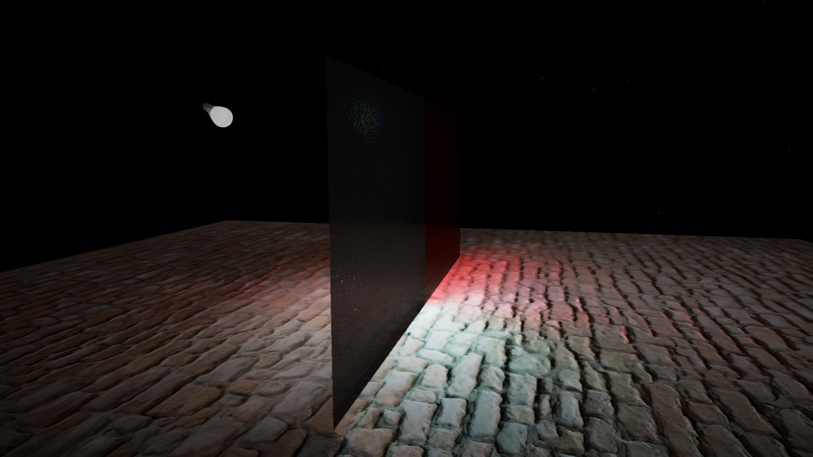
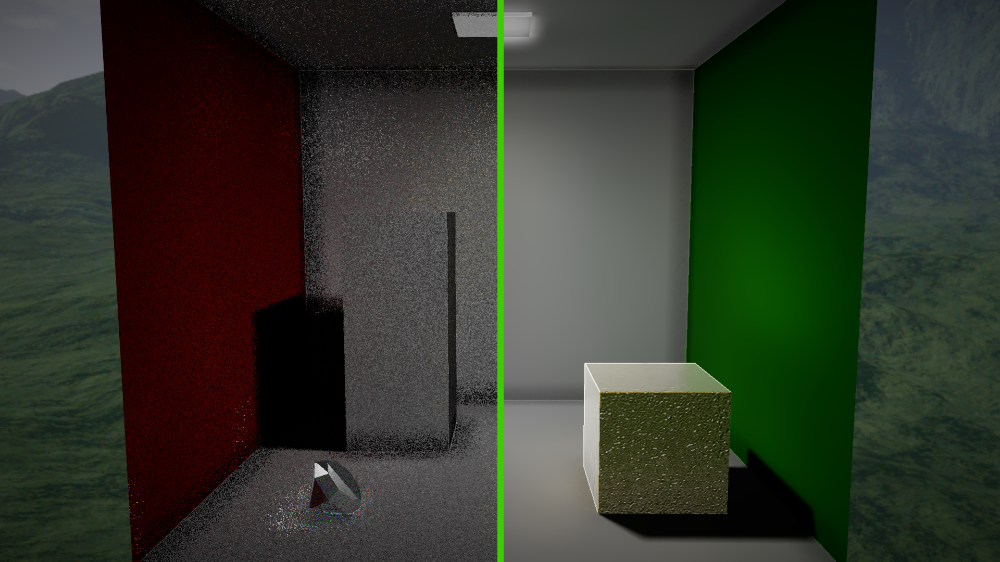

# Real Time Path Tracer
The application is a fork of UnoGameEngine, my own game engine that started from an implementation of the code from the book "3D Game Programming with DirectX 12" by Frank D. Luna.
Ray tracing has been implemented following NVIDIA's tutorials and uses a version of their libraries modified by me.
https://developer.nvidia.com/rtx/raytracing/dxr/DX12-Raytracing-tutorial-Part-1
https://developer.nvidia.com/rtx/raytracing/dxr/dx12-raytracing-tutorial-part-2

This path tracer includes:
- DirectX Raytracing (DXR)
- Monte carlo path tracing
- [NVIDIA DLSS](https://github.com/NVIDIA/DLSS)
- [NVIDIA NRD denoiser](https://github.com/NVIDIA-RTX/NRD) (Spherical Harmonics Mode)
- PBR materials
- PBR rendering
- Ray reconstruction (blurry for solid-color surfaces)
- ReSTIR
- Burley BRDF (Diffuse) + GGX BRDF (Specular)
- Tone mapping (Reinhard, Uncharted2, ACES, AGX)
- Spectral dispersion

Features coming in the future:
- NVidia DLSS Frame Generation (I have a model 30 RTX GPU)
- AMD FSR
- Temporal shader without DLSS
- ...

# Build

This project uses **Visual Studio 2022** with **Premake**.  
To build the project:
1. Clone the respository  
<code>git clone https://github.com/edoardo911/Real-Time-Path-Tracer.git</code>
2. Compile project files:  
<code>generate_projects.bat</code>  
This will automatically link all libraries inside <code>vendor</code> and latest Windows SDK into the project  
3. Open the project in visual studio and compile it
4. Add the DLLs inside the folder <code>DLLs</code> in the corresponding sub-directory in <code>bin</code>.

To run this project you need a GPU that supports ray tracing:

- NVIDIA: models RTX 20xx, RTX 30xx, RTX 40xx and RTX 50xx
- AMD: models RX 6000, RX 7000, RX 9000

# DLSS
**DLSS** has been implemented following NVIDIA's guidelines
https://github.com/NVIDIA/DLSS/blob/main/doc/DLSS_Programming_Guide_Release.pdf
https://github.com/NVIDIA/DLSS/blob/main/doc/DLSS-RR%20Integration%20Guide.pdf

# Denoising
The application uses **NRD** to denoise diffuse, specular and shadow signals.
https://github.com/NVIDIAGameWorks/RayTracingDenoiser

# Implementation Notes
The file `src/utils/keys.h` contains all private keys used by the engine and therefore it's not included among the project files.
It defines an `inline const char projectKey[38]` inside engine namespace initialized following the NVIDIA DLSS' guidelines: 
> Project ID is assumed to be GUID-like, for instance: "a0f57b54-1daf-4934-90ae-c4035c19df04"

It is also important to mention that in order to run the project you need the libraries `NRD.dll`, `dxcompiler.dll`, `dxil.dll`, `nvngx_dlss.dll` and `nvngx_dlssd.dll` inside the folder where the executable is located.
You can download them from the respective repositories (note that the NRD dll will be available after compiling the NRD project).
Alternatively you can run it in release mode and use the DLLs that you find in the latest release.

# Performance
On my machine (AMD Ryzen 7 1700, NVIDIA RTX 3060, 32GB RAM), 1080p all settings to max and DLSS off, I get the following performance:
- Box scene: ~40/50 FPS
- Flashlight scene: ~40/50 FPS
- Indirect scene: ~43/51 FPS

# Importance Sampling

The big difference between ray tracing and path tracing is noise. To accurately calculate the lighting of a scene,
you need to solve the [rendering equation](https://en.wikipedia.org/wiki/Rendering_equation), which is an integral over the emisphere centered around the normal.  
The best way to solve an integral numerically in this case in Monte Carlo integration, which requires calculating the integral using random samples and letting the final image converge over time.  
This is not practical for real time, since the final image will be noisy because we're sampling random point on the hemisphere, even with real time denoisers or temporal reprojections.  
That's why we need importance sampling: instead of choosing random samples, we sample points using specific probability functions, then we divide the lighting result by the Probability Density Function (PDF) to normalize it back.  
NVidia's NRD suggests:

- Cosine weight for diffuse signals
- VNDF for specular signals
- Custom importance sampling for shadows

<b>Cosine weight</b> is a distribution function that generates directions on a hemisphere by giving more importance to those closer to the normal (hence cosine-weight).  
<b>VNDF</b> is a distribution function that generates half vectors (that's why it works better for specular signals).  
For shadows in this implementation I turned directional lights, point lights and spotlights into area light using a radius.  

- <b>Directional lights</b>: I created a disk (circumference) based on the radius calculated as tan(theta_max) (where theta_max for the sun is 0.57 degrees which return a radius of 0.004) and finally generated directions towards that disk
- <b>Point lights</b>: I created a sphere centered on the light's position, generated a random position on the sphere and generated directions from the shading point to the random points on the sphere
- <b>Spot lights</b>: I created a hemisphere on the light's position pointing towards the light's main direction, generated random points on the hemisphere and generated directions from the shading point to the random points on the hemisphere

# Screenshots
Result:

Spectral dispersion:

Box scene:

Flashlight scene:

Indirect scene:

Bedroom scene:
